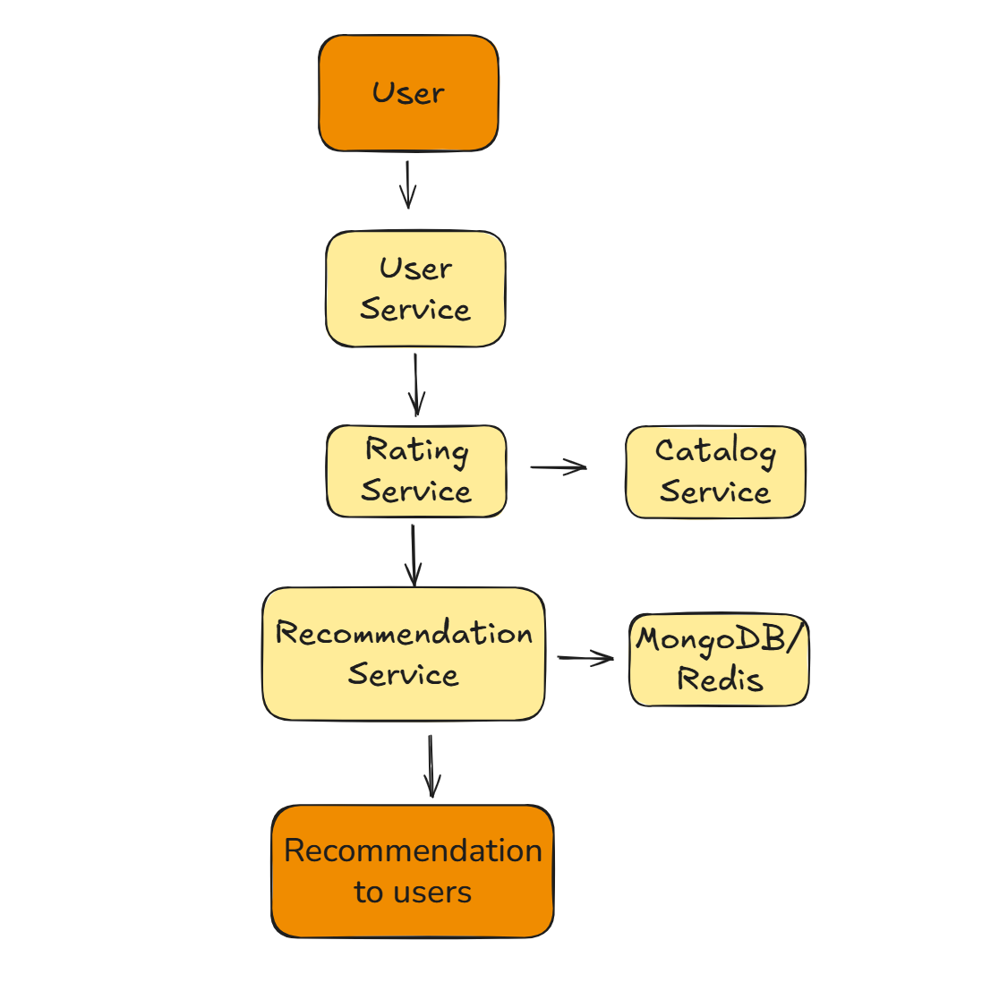

# Mini Netflix - Movie/Book Recommender

Mini Netflix is an **API that provides movie and book recommendations** based on each user's preferences, using a basic recommendation algorithm based on similar users.

---

## 🚀 Features

- Add **ratings** for movies or books.
- Get **personalized recommendations** for each user.
- Simple **user-based recommendation algorithm**.
- Unit tests to validate ratings and recommendations.

---

## 🛠 Technologies

- **Backend:** Java, Spring Boot  
- **Database:** MongoDB  
- **Cache:** Redis  
- **Containers:** Docker  

---

## 🗂 Database Structure

- **users:** user information (name, preferences, etc.)  
- **movies:** catalog of movies or books  
- **ratings:** ratings assigned by users

---
## 🔗 API Endpoints

### Catalog Service

**Base URL:** `/catalog`

| Endpoint | HTTP | Description | Request Body | Response |
|----------|------|-------------|--------------|----------|
| `/addMovie` | POST | Add one or more movies | List of Catalog objects | List of created movies |
| `/all` | GET | Retrieve all movies | - | List of Catalog objects |
| `/id/{movieId}` | GET | Retrieve movie by ID | - | Catalog object |
| `/update/{movieId}` | PUT | Update movie details | CatalogUpdateDto | Updated Catalog object |
| `/delete/{movieId}` | DELETE | Delete a movie by ID | - | 204 No Content |
| `/byTitle/{title}` | GET | Retrieve movie by title | - | Catalog object |
| `/updateScore` | PUT | Update average rating | RatingScoreDTO | Updated Catalog object |
| `/getByGenre` | POST | Filter movies by genres | List of Genre | List of Catalog objects |
| `/getTopThree` | GET | Retrieve top 3 movies by rating | - | List of Catalog objects |
| `/group-by-genre/{genre}` | GET | Group movies by genre | - | Map of Genre → List of CatalogDTO |

---

### Rating Service

**Base URL:** `/rating`

| Endpoint | HTTP | Description | Request Body | Response |
|----------|------|-------------|--------------|----------|
| `/addRating` | POST | Add one or more ratings | List of Rating objects | List of created ratings |
| `/addAndCalculateAverage` | POST | Add rating and update catalog average | RatingUserDTO | `{ "movieId": "123", "averageScore": 4.2, "message": "Rating added and catalog updated successfully" }` |
| `/all` | GET | Retrieve all ratings | - | List of Rating objects |
| `/{id}` | GET | Retrieve rating by ID | - | Rating object |
| `/byMovie/{movieId}` | GET | Retrieve ratings for a movie | - | List of Rating objects |
| `/update/{id}` | PUT | Update a rating | RatingDTO | Updated Rating object |
| `/delete/{id}` | DELETE | Delete a rating | - | 204 No Content |

---

### Recommendation Service

**Base URL:** `/recommendation`

| Endpoint | HTTP | Description | Request Body | Response |
|----------|------|-------------|--------------|----------|
| `/getAll` | GET | Retrieve all recommendations | - | List of Recommendation objects |
| `/userId/{userId}` | GET | Recommendations for a user | - | List of Recommendation objects |
| `/createRecommendation` | POST | Generate new recommendations | - | List of Recommendation objects |
| `/userByMovie/{movieId}` | GET | Users who got recommendation for a movie | - | List of UserDTO objects |
| `/getByMinScore/{minScore}` | GET | Movies with min recommended score | - | List of CatalogDTO objects |

---

### User Service

**Base URL:** `/user`

| Endpoint | HTTP | Description | Request Body | Response |
|----------|------|-------------|--------------|----------|
| `/addUser` | POST | Add one or more users | List of User objects | List of created users |
| `/all` | GET | Retrieve all users | - | List of User objects |
| `/{userId}` | GET | Retrieve user by ID | - | User object |
| `/update/{userId}` | PUT | Update user info | UserDTO | Updated UserDTO |
| `/getByRole/{role}` | GET | Retrieve users by role | - | List of User objects |
| `/sendRating` | POST | Submit rating and update catalog | RatingUserDTO | Confirmation message |
| `/get-by-preferences?preferences=...` | GET | Retrieve users by preferences | - | List of User objects |
| `/count-by-roles` | GET | Count users grouped by roles | - | List of UserRoleDTO objects |

---

## 📊 Architecture Diagram



## ⚙ Installation & Running


1. Clone the repository:  
```bash
git clone https://github.com/your-username/mini-netflix.git
cd mini-netflix
```

2. Set up MongoDB and Redis (locally or via Docker).

3 .Build and run the application with Maven:

```bash
./mvnw clean install
./mvnw spring-boot:run
```

4. Or run with Docker:

```bash
docker-compose up --build
```

🧪 Testing

The project includes unit tests to:

- Validate rating storage.
- Verify the recommendation logic based on similar users.

Run tests with Maven:

```bash
./mvnw test
```
📈 Recommendation Algorithm
Uses a simple user-based similarity algorithm, comparing user ratings to recommend movies or books enjoyed by users with similar tastes.


✨ Future Improvements

- Content-based recommendations (genre, author, director).
- User authentication and profiles.
- Web or mobile UI for interacting with the API.

